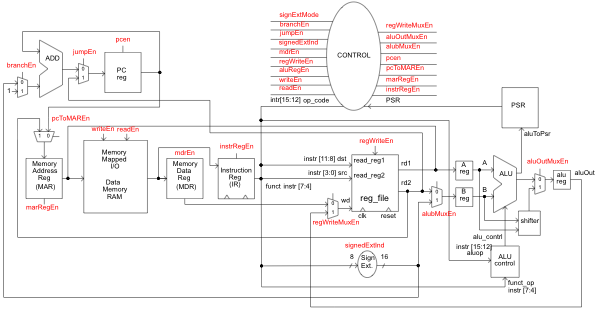

# CR16 (16-bit) Processor - Duck Hunt Game

ECE 3710 - Fall 2019 Group Project - University of Utah

This documentation is an overall description to the CR16 ISA Processor project (Duck Hunt Game). This work includes the design/build of a 16-bit processor (from scratch) onto an Intel Cyclone V FPGA board, assembler program for selected ISA assembly instructions, I/O, and the application to run our custom version of the Nintendo Entertainment System (NES) game of Duck Hunt (application).

## Complete CR16 Processor Diagram

This diagram is the complete CR16 processor. The processor executes all the assembly instructions generated to run the application (Duck Hunt Game). The entire processor was designed and built from scratch using FPGA (using Verilog code).

The system consists of the Datapath, control finite state machine (FSM), ALU control, and memory.

## Processor Datapath Diagram

This diagram is the complete datapath infrastructure (digital logic design). Including the program counter (PC), Instruction Registers (IR), Sign Extension, and Memory and Memory-Mapped I/O system.

## CR16 Assembler

The Assembler program was written to assemble all the application assembly code that is written into machine code for the processor to execute. The GUI interface is used to select the assembly file code and generate the hexidecimal machine code.

Example of assembly code:

## GlyphMaker Program Interface

The GlyphMaker program was written to create all the necessary 16x16 glyphs for the Duck Hunt Game application. All glyphs were built and used for VGA display. The sample shown is of one of the ducks we developed (drawing on the interface).

## I/O Design

The duck hunt game requires the use of a Light Zapper gun. The I/O needed was designed/developed with the following circuit board for user control.

## Duck Hunt flying simple example

